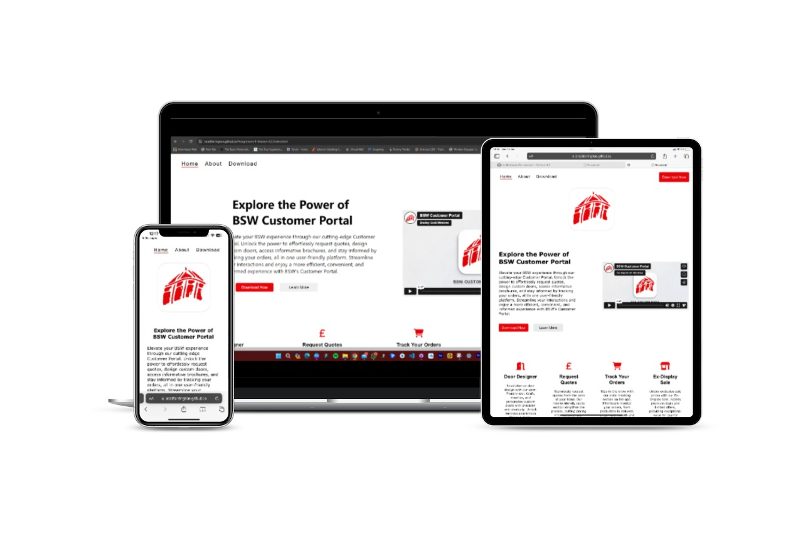
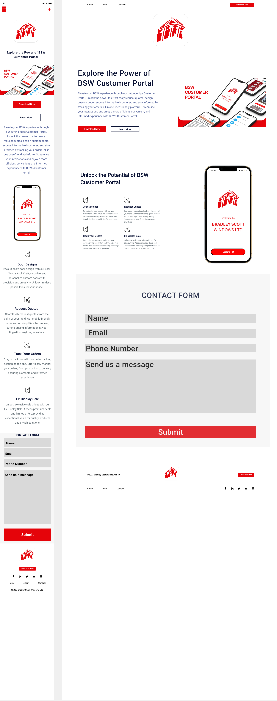
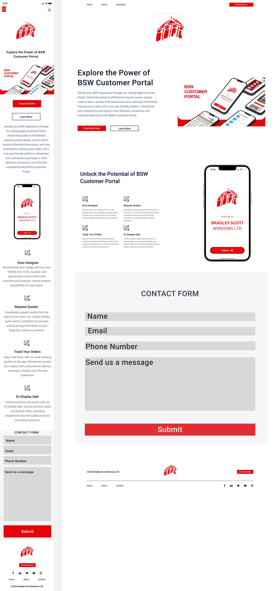
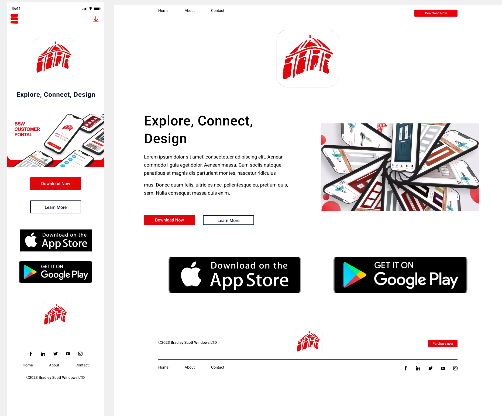

# BSW Customer Portal
( Developer: Brad Farrington )

[Live Webpage](https://bradfarrington.github.io/Assignment-1-Version-4.2/index.html)

This is the website for the BSW Customer Portal. It is designed to be responsive across all devices making the information supplied easily accessible.

## Table of Content

1. [Project Goals](#project-goals)
    1. [User Goals](#user-goals)
    2. [Site Owner Goals](#site-owner-goals)
2. [User Experience](#user-experience)
    1. [Target Audience](#target-audience)
    2. [User Requirements and Expectations](#user-requirements-and-expectations)
    3. [User Stories](#user-stories)
3. [Design](#design)
    1. [Design Choices](#design-choices)
    2. [Colours](#colours)
    3. [Fonts](#fonts)
    4. [Structure](#structure)
    5. [Wireframes](#wireframes)
4. [Features](#features)
5. [Testing](#testing)
    1. [HTML Validation](#HTML-validation)
    2. [CSS Validation](#CSS-validation)
    3. [Accessibility](#accessibility)
    4. [Performance](#performance)
    5. [Device Testing](#device-tests)
    6. [Browser Compatibility](browser-compatibility)
6. [Bugs](#bugs)
7. [Deployment](#deployment)
10. [Credits](#credits)
11. [Acknowledgements] (#acknowledgements)

## Project Goals

Primary goal is to create a good looking website which has plenty of information about the BSW Customer Portal app. 
Secondary goal is to get users to interact with the form and the videos and to download the app to their mobile devices.

### User Goals
- A good display and easy to navigate website.
- Precise information about what the app is used for.
- Simple to use forms to contact the business.
- Promotional Videos to give the user more information about the app.
- Call to action buttons which the user can follow throught the site.

### Site OWner Goals
- Increase the number of app users.
- Promote the overall business of Bradley Scott Windows.
- Provide a way for new users to download the app.
- Inform the user of the apps features.

### Developer Goals
- A clean design which stands out to the user.
- A website which responds to multiple device types and sizes.
- Easy navigation throughout the site.
- A website to include in their portfolio.

## User Experience

### Target Audience
- Ages 18+
- Any of Bradley Scott Windows' customers.
- Any new potential customer of Bradley Scott Windows.

### User Requirements and Expectations
- A simple naviagtion process.
- Quickly find the relevant information.
- Links that work as expected.
- A well presented, easy to read website.
- Acessibility

### User Stories

#### First Time User
1. As a first time user, i want to know what the app does.
2. As a first time user, i want to know how to download the app.
3. As a first time user, i want to easily contact the company.
4. As a first time user, i want to learn about what i can get from the app.

#### Returning User
5. As a returning user, i want to remember where i seen a specific part of information.
6. As a returning user, i want the website to be the same as the previous time i looked.
7. As a returning user, i want to be able to share the website easily.

#### Site Owner
8. As the site owner, i would like to be proud of the website i am hosting online.
9. As the site owner, i would like users to be able to navigate easily throughout my website.
10. As the site owner, i would like users to share the website.
11. As the site owner, i would like users to download the app.
12. As the site owner, i would like users to contact us through the form.

## Design

### Design Choices

The layout i chose follows the same structure throughout the site making it easily accessible to the user. The site follows a simple design matching the companies brand colours and logo.

### Colours

Bradley Scott Windows has a simple colour scheme for its brand. This consists of red, white, black and grey. The red makes it stand out to customers whilst white gives us a nice back layer to present the red on. The black also stands out and is easy to read whilst grey is more subtle to keep the user at ease.

Primary Colours - Red / White
Secondary Colours - Black / Grey

Red and white being the primary due to the red standing out well when put against a white background.

Specific colours used on the site are:
1. Black: #000000
2. White: #ffffff
3. Red: #e5040a
4. Grey: D8D8D8

### Fonts

I have chosen a font family for my website which will alow the browser to select one of the various fonts within the family depending on the browser.
These fonts are :

1. Arial
2. Helvetica
3. sans-serif

I have chosen a font family so that the fonts of all text are consistent throughout the website to keep the design sleek and easily readi

### Structure

The page is structured in a user-friendly easy to follow way. When they arrive on the landing the page they will see a simple navigation bar and the logo of the app which is intended to be downloaded below it and this consists on each page of the website. All navigation links take them to a seperate page which contains different information about the app itself.

The website consists of three seperate pages:
- A homepage which gives them a brief description of the features the app has including a promotional video and a contact form.
- The about page which goes more in depth to the three main features of the app, also containing a different promotional video about one distinct feature.
- The download page which is short and simple with two call to action buttons depending on if they would like the app for apple for android devices.

### Wireframes

Home

About

Download

## Technologies Used

### Languages
- [HTML](https://en.wikipedia.org/wiki/HTML)
- [CSS](https://en.wikipedia.org/wiki/CSS)

### Frameworks and Tools
- [GitHub](https://github.com)
- [Font Awesome](https://fontawesome.com/search)
- [Favicon](https://favicon.io/)
- [Figma](https://figma.com)
- [W3C Validator](https://validator.w3.org/)
- [Jigsaw CSS Validator](https://jigsaw.w3.org/css-validator/) 