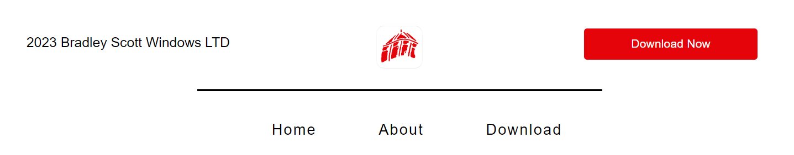

# BSW Customer Portal
( Developer: Brad Farrington )

[Live Webpage](https://bradfarrington.github.io/Assignment-1-Version-4.2/index.html)

This is the website for the BSW Customer Portal. It is designed to be responsive across all devices making the information supplied easily accessible.

## Table of Content

1. [Project Goals](#project-goals)
    1. [User Goals](#user-goals)
    2. [Site Owner Goals](#site-owner-goals)
2. [User Experience](#user-experience)
    1. [Target Audience](#target-audience)
    2. [User Requirements and Expectations](#user-requirements-and-expectations)
    3. [User Stories](#user-stories)
3. [Design](#design)
    1. [Design Choices](#design-choices)
    2. [Colours](#colours)
    3. [Fonts](#fonts)
    4. [Structure](#structure)
    5. [Wireframes](#wireframes)
4. [Features](#features)
5. [Testing](#testing)
    1. [HTML Validation](#HTML-validation)
    2. [CSS Validation](#CSS-validation)
    3. [Accessibility](#accessibility)
    4. [Performance](#performance)
    5. [Device Testing](#device-tests)
    6. [Browser Compatibility](browser-compatibility)
    7. [Testing User Stories](testing-user-stories)
6. [Deployment](#deployment)
7. [Credits](#credits)
8. [Acknowledgements](#acknowledgements)

## Project Goals

Primary goal is to create a good looking website which has plenty of information about the BSW Customer Portal app. 
Secondary goal is to get users to interact with the form and the videos and to download the app to their mobile devices.

### User Goals
- A good display and easy to navigate website.
- Precise information about what the app is used for.
- Simple to use forms to contact the business.
- Promotional Videos to give the user more information about the app.
- Call to action buttons which the user can follow throught the site.

### Site Owner Goals
- Increase the number of app users.
- Promote the overall business of Bradley Scott Windows.
- Provide a way for new users to download the app.
- Inform the user of the apps features.

### Developer Goals
- A clean design which stands out to the user.
- A website which responds to multiple device types and sizes.
- Easy navigation throughout the site.
- A website to include in their portfolio.

## User Experience

### Target Audience
- Ages 18+
- Any of Bradley Scott Windows' customers.
- Any new potential customer of Bradley Scott Windows.

### User Requirements and Expectations
- A simple naviagtion process.
- Quickly find the relevant information.
- Links that work as expected.
- A well presented, easy to read website.
- Acessibility

### User Stories

#### First Time User
1. As a first time user, i want to know what the app does.
2. As a first time user, i want to know how to download the app.
3. As a first time user, i want to easily contact the company.
4. As a first time user, i want to learn about what i can get from the app.

#### Returning User
5. As a returning user, i want to remember where i seen a specific part of information.
6. As a returning user, i want the website to be the same as the previous time i looked.
7. As a returning user, i want to be able to share the website easily.

#### Site Owner
8. As the site owner, i would like to be proud of the website i am hosting online.
9. As the site owner, i would like users to be able to navigate easily throughout my website.
10. As the site owner, i would like users to share the website.
11. As the site owner, i would like users to download the app.
12. As the site owner, i would like users to contact us through the form.

## Design

### Design Choices

The layout i chose follows the same structure throughout the site making it easily accessible to the user. The site follows a simple design matching the companies brand colours and logo.

### Colours

Bradley Scott Windows has a simple colour scheme for its brand. This consists of red, white, black and grey. The red makes it stand out to customers whilst white gives us a nice back layer to present the red on. The black also stands out and is easy to read whilst grey is more subtle to keep the user at ease.

Primary Colours - Red / White
Secondary Colours - Black / Grey

Red and white being the primary due to the red standing out well when put against a white background.

Specific colours used on the site are:
1. Black: #000000
2. White: #ffffff
3. Red: #e5040a
4. Grey: D8D8D8

### Fonts

I have chosen a font family for my website which will alow the browser to select one of the various fonts within the family depending on the browser.
These fonts are :

1. Arial
2. Helvetica
3. sans-serif

I have chosen a font family so that the fonts of all text are consistent throughout the website to keep the design sleek and easily readi

### Structure

The page is structured in a user-friendly easy to follow way. When they arrive on the landing the page they will see a simple navigation bar and the logo of the app which is intended to be downloaded below it and this consists on each page of the website. All navigation links take them to a seperate page which contains different information about the app itself.

The website consists of three seperate pages:
- A homepage which gives them a brief description of the features the app has including a promotional video and a contact form.
- The about page which goes more in depth to the three main features of the app, also containing a different promotional video about one distinct feature.
- The download page which is short and simple with two call to action buttons depending on if they would like the app for apple for android devices.

### Wireframes

Home

About

Download

## Technologies Used

### Languages
- [HTML](https://en.wikipedia.org/wiki/HTML)
- [CSS](https://en.wikipedia.org/wiki/CSS)

### Frameworks and Tools
- [GitHub](https://github.com)
- [Font Awesome](https://fontawesome.com/search)
- [Favicon](https://favicon.io/)
- [Figma](https://figma.com)
- [W3C Validator](https://validator.w3.org/)
- [Jigsaw CSS Validator](https://jigsaw.w3.org/css-validator/) 

## Features
The page consists of three pages, two videos, a contact form and two call-to-action buttons.

### Navigation Bar
- Featured on all three pages
- The navigation bar is fully responsive and changes sizes when viewing on smaller or larger screens. It includes links to the home, about and download page.
- It allows the users to easily naviagte throughout the website.
- The link for the page is user is currently on is underlined in red.
- The right hand side of the header on desktop devices has a button which links to the download page, this is hidden when viewed on smaller screen sizes.

### Landing Page
- App logo with a brief description and a video explaining the features of the app
- Background colour to match throughout the website.

### Mockup Images and Descriptions
- Shows the user how the app will look on their device
- Easily viewable to the user
- Promotes the features of the app

### Videos
- Allows the user to engage and learn about the app through watching a video
- User has full access to controls. Volume, full screen, play and pause.

### Footer
- Featured on all three pages.
- Consists of two seperate sections. One being the logo, copyright and a call-to-action button, the other including the navigation bar to again easily navigate to other pages.

### Home
- Introduces the user to the mobile app and its features.
- Explains brief descriptions about the main uses of the application.
- Allows the user to contact the company directly through a contact form.

### About
- Allows the user to dive depper into the features and learn more about what the application can do.
- Provides screenshots of the app in use to show the user how it will be used on their device.

### Download
- Provides the user with clear call-to-action buttons to download the application.
- Page includes the main video from the home page so they can watch it again if they wish.

## Testing

### HTML Validation

The W3C Markup Validation Service was used to validate the HTML of the website. All pages pass with no errors.

index.html [results](https://validator.w3.org/nu/?doc=https%3A%2F%2Fbradfarrington.github.io%2FAssignment-1-Version-4.2%2Findex.html)

about.html [results](https://validator.w3.org/nu/?doc=https%3A%2F%2Fbradfarrington.github.io%2FAssignment-1-Version-4.2%2Fabout.html)

download.html [results](https://validator.w3.org/nu/?doc=https%3A%2F%2Fbradfarrington.github.io%2FAssignment-1-Version-4.2%2Fdownload.html)

### CSS Validation

The W3C Jigsaw CSS Validation Service was used to validate the CSS of the website. When pasting in my code using direct input the results were complete with no warnings.

style.css

### Accessibility

The WAVE WebAIM web accessibility evaluation tool was used to ensure the website met high accessibility standards. All pages pass with 0 errors.

index.html [results](https://wave.webaim.org/report#/https://bradfarrington.github.io/Assignment-1-Version-4.2/index.html)

about.html[results](https://wave.webaim.org/report#/https://bradfarrington.github.io/Assignment-1-Version-4.2/about.html)

download.html[results](https://wave.webaim.org/report#/https://bradfarrington.github.io/Assignment-1-Version-4.2/download.html)

### Performance

Google Lighthouse in Google Chrome Developer Tools was used to test the performance of the website. All aspects performing well.

index.html

about.html

download.html

### Performing test on various devices
The website was tested on the following devices:
- Imac 27"
- iPad Pro
- iPad Air
- iPhone 13

In addiditon the website was tested using Chrom Dev Tools device toggle option.

### Browser Compatibility
The website was tested on the following browser:
- Google Chrome
- Apple Safari 13 and 16
- Mozilla Firefox

### Testing User Stories

#### First-time User

1. As a firt-time user, I want to know what the app does.

| **Feature** | **Action** | **Expected Result** | **Actual Result** |
|-------------|------------|---------------------|-------------------|
| Video | On index page watch the video when it autoplays | Video autoplays highlighting the features | Works as expected |
| Mockup Image | On index page scroll down to the feature list | See the mockup image | Works as expected |

Watch Video / See Mockup Image

 

2. As a firt-time user, I want to know how to download the app.

| **Feature** | **Action** | **Expected Result** | **Actual Result** |
|-------------|------------|---------------------|-------------------|
| Download Buttons | On index page look for the download now buttons | Takes the user to the download page | Works as expected |
| App Store Links | On download page click either apple store or play store | Takes the user to the correct store to download | Works as expected |

Download Button / App Store Links

 

3. As a first time user, i want to easily contact the company.

| **Feature** | **Action** | **Expected Result** | **Actual Result** |
|-------------|------------|---------------------|-------------------|
| Contact Form | On index page scroll down to the contact us section | Fill out details and submit | Works as expected |

Contact Us Form

 

4. As a first time user, i want to learn about what i can get from the app.

| **Feature** | **Action** | **Expected Result** | **Actual Result** |
|-------------|------------|---------------------|-------------------|
| Video | On index page watch the video when it autoplays | Video autoplays highlighting the features | Works as expected |
| Mockup Image | On index page scroll down to the feature list | See the mockup image | Works as expected |

Watch Video / See Mockup Image

 

#### Returning User

5. As a returning user, i want to remember where i seen a specific part of information.

| **Feature** | **Action** | **Expected Result** | **Actual Result** |
|-------------|------------|---------------------|-------------------|
| Navigation Bar | Easily navigate through the pages of the website | Access each page with ease | Works as expected |
| Footer Navigation Bar | Easily navigate through the pages of the website | Access each page with ease | Works as expected |

Navigate Website

 

6. As a returning user, i want the website to be the same as the previous time i looked.

| **Feature** | **Action** | **Expected Result** | **Actual Result** |
|-------------|------------|---------------------|-------------------|
| Static Website | Easily navigate through the pages of the website | Visuals havent changed | Works as expected |

Static Website

 

7. As a returning user, i want to be able to share the website easily.

| **Feature** | **Action** | **Expected Result** | **Actual Result** |
|-------------|------------|---------------------|-------------------|
| URL | Copy the link to share the website | Share Successfully | Works as expected |

Share URL

 

#### Site Owner

8. As the site owner, i would like to be proud of the website i am hosting online.

| **Feature** | **Action** | **Expected Result** | **Actual Result** |
|-------------|------------|---------------------|-------------------|
| Design | Visit the page regularly to fix any bugs | Website has a good appearance and performace | Works as expected |

Website Design

 

9. As the site owner, i would like users to be able to navigate easily throughout my website.

| **Feature** | **Action** | **Expected Result** | **Actual Result** |
|-------------|------------|---------------------|-------------------|
| Navigation Bar | Easily navigate through the pages of the website | Access each page with ease | Works as expected |
| Footer Navigation Bar | Easily navigate through the pages of the website | Access each page with ease | Works as expected |

Navigate Website

 

10. As the site owner, i would like users to share the website.

| **Feature** | **Action** | **Expected Result** | **Actual Result** |
|-------------|------------|---------------------|-------------------|
| Share URL | Copy the link to share the website | Share Successfully | Works as expected |

Share URL

 

11. As the site owner, i would like users to download the app.

| **Feature** | **Action** | **Expected Result** | **Actual Result** |
|-------------|------------|---------------------|-------------------|
| Download Buttons | On index page look for the download now buttons | Takes the user to the download page | Works as expected |
| App Store Links | On download page click either apple store or play store | Takes the user to the correct store to download | Works as expected |

Download Button / App Store Links

 

12. As the site owner, i would like users to contact us through the form.

| **Feature** | **Action** | **Expected Result** | **Actual Result** |
|-------------|------------|---------------------|-------------------|
| Contact Form | On index page scroll down to the contact us section | Fill out details and submit | Works as expected |

Contact Us Form

 

 ## Deployment

The website was deployed using GitHub Pages by following these steps:
1. In the GitHub repository navigate to the Settings tab
2. On the left-hand menu select Pages
3. For the source select Branch: master
4. After the webpage refreshes automatically you will see a ribbon on the top saying: Your site is live at bradfarrington.github.io/Assignment-1-Version-4.2/

## Credits

### Media

All custom images and videos throughout the website were created by the developer and owned by <strong> Bradley Scott Windows LTD </strong>.

App store logos are from Google Images

### Code

All code in this website was created by the developer.

### Acknowledgments

I would like to take the opportunity to thank:

- My team mates on the Code Insitute Web Development course.
- South Staffordshire College and my tutor Adam for their support and help throughout.